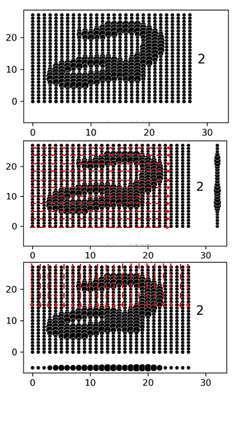
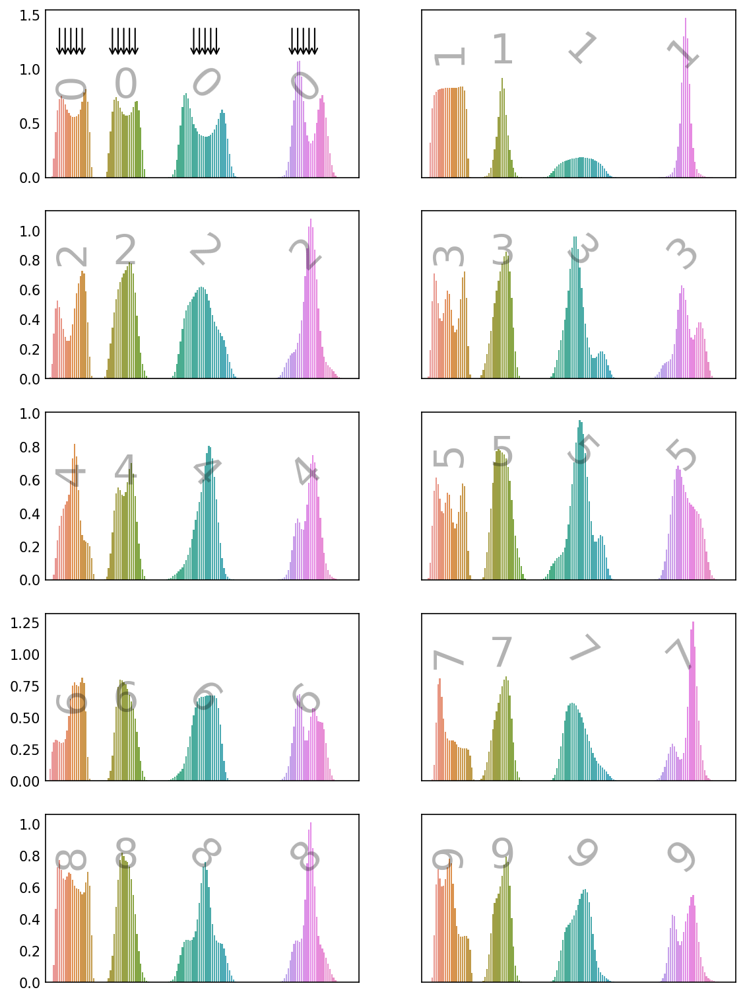

# A couple of cool things I did during my Data Science studies

# MNIST

Sure, every book and course introduces the data science student to the MNIST dataset. When I had to find a solution to the problem using logistic regression I tackled the problem in a way I have not seen done before. Instead of using the pixels as such, I decided to use the "shadows" of the pixels. That is, I projected across a given direction (for example, horizontally in the second frame below) to add up the pixel intensities along thoses axes - the vertical line at the right of the second frame. The bottom frame show a vertical "shadow".

    

I also added diagonal "shadow" lines and the result for all digits looks like this:

    

You can see that the projection along certain axes makes the distinction between the commonly confused digits (say, 3 & 8 or 3 & 5) more pronounced. I was able to get 92.6% accuracy with just logistic regression. I know, a neural net can blow that number out of the water. But the point about this is that another way of thinking about a problem can lead to insights (like the dominant skew in the writing of either a left-handed or right-handed person) or, better yet, spark a eureka moment in a team mate.

